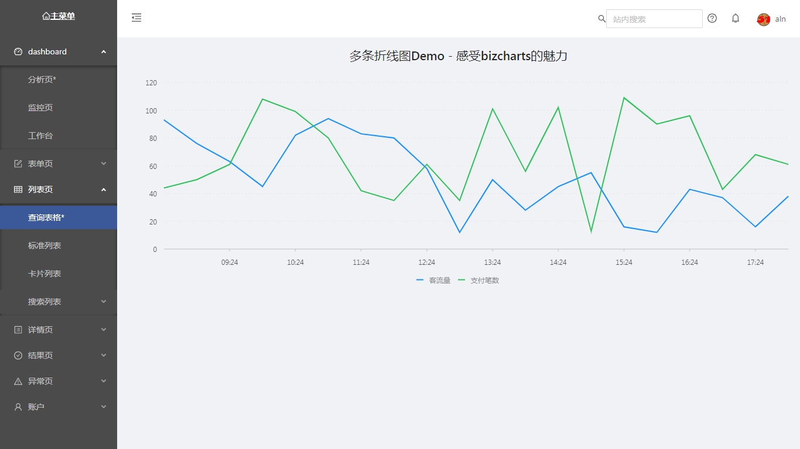
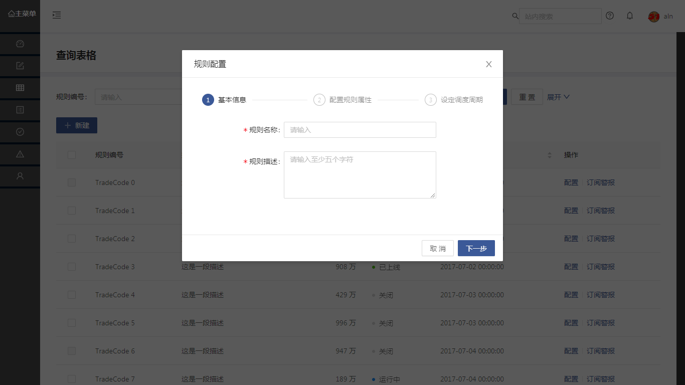
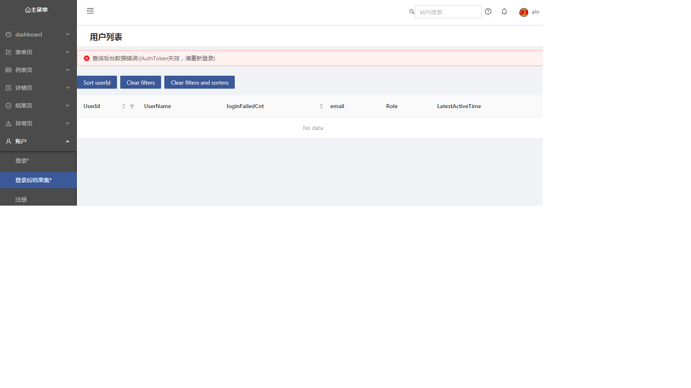

> 本项目主要用来观察AntD的阿里开源React 组件包， 可以说每个页面的代码都亲手修改了一遍，很多注释是特意保留的， 结构化的改变随处可见
> allan.chow@139.com

## package.json ##

去除了dva , roadhog等 再包装内容， 使用了通用的webpack, redux, redux-saga, MockJs等内容.

> 另外对 menu 显示， routes嵌套做了较大的改动， 主routes配置到了menu, 子routes 可以独立在自己的module里定义json. 同时用了异步加载

## component ##
组件库保留了不少通用的组件， 比如exception, result等.

## 主要修改点 ##

1. app.jsx 使用传统的redux-saga flow.
2. main\index.jsx 主体layout - 分3 块， leftmenu, header, content
3. 逐一测试antd的各个组件 form, table list, detail page.

## dist 目录下有 index.html 可以直接看效果， 更新可能不及时 ##
###个别页面
 
 
 

## 加入的列表， 会逐一列在下面...
1. 表单页 - 基础和分步表单， 如何生成表单， 获取数据(add src/mock)， 验证数据， redux/reducer连接, src/routes/forms
2. 常用错误页面, 结果页面, src/components/PageHeader/*
3. 基础表格， 新增/修改子页面， 数据装载等， src/routes/List/* , src/app.jsx
4. re-organize redux-saga
5. re-organize webpack
6. BizChart图表， 组件封装，栅格系统， src/routes/Dashboard/*
7. 加入详情页面， DescriptionList/Description 组件封装的很好， src/routes/profile
8. 准备从几个springboot 项目中， 抽取典型代码框架， 作为后端配套： springboot1.5.8, mysql/mybatis(annotation or xml), 基础错误处理机制， 统一json返回结构（手机端.web通用）， 基础安全认证(JWT搭配redis拒绝可疑调用)， 高并发（rabbitmq/googleguawa/redis）, XA分布事务(atomikos/druid).
9. 加入login page, 复杂的多个文件还原到一个页面
10. 加入third-party js md5, 连通后端login aciton, JWT验证
11. re-organize api token安全调用部分, 加入UserList
12.
13.
14.

## 类似AntD, 其实有更多优秀的组件库 ##

Google:  https://material-ui.com/demos/app-bar/

Bootstrap: https://react-bootstrap.github.io/components/alerts/

## 分享一个组件开发思路 ##
https://gist.github.com/152f07bdc8a2f39aace929495ccf5709 

